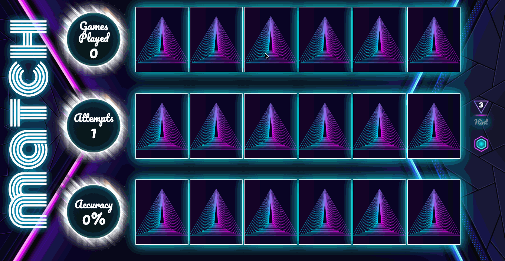

# Neon Memory Match

> - Maintained by: `cherie-pavicoTsukayama`

## Description

A memory game where the user attempts to find matching pairs of images. The game tracks the user's attempts, accuracy, and how many games they have played.

The game can be toggled to play in normal mode (18 cards)  or hard mode (36 cards). Sound effects and background music can also be toggled on or off.

## Live Demo
Try the application live at https://memory-match.cheriepavico.com/

## Technologies Used
- HTML
- CSS
- JavaScript
- Vs Studio Code
- freepik.com
- Goggle Chrome
- Github

## Features
1. Checking for a matched card
2. Dynamic game board creation for both Normal and Hard mode.
3. Hint button that hints to the matching card.
    - Allows only 3 hints per game.
    - Hint counter resets each new game.
4. Sound effects when the card is clicked and when cards are matched.
    - It can be toggled on and off by the player.
    - The default is off.
5. Background Music that can be toggled on and off by the user in the settings.
6. Mobile responsive for the iPhone 6, 7, 8, and iPad.
    - Portrait and landscape.
7. The game keeps track of player's accuracy, attempts to make a match per game and how many games the player has played.

## Preview

## System Requirments
- Google Chrome
- Text Editor. Recommended VS Studio Code.

## Getting Started
1. Fork and clone the repository.
2. Start the project.
